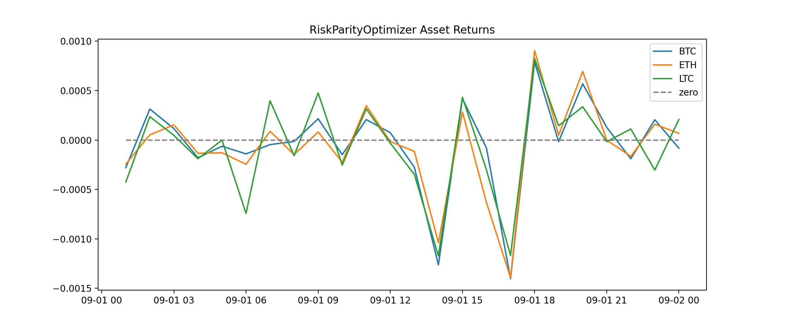

# SingAllianceCoding
The solution to this coding assignment can be found in this repository.  
There are 2 main modules,   
1) **DataFetcher**, This module is responsible for fetching data from the Binance Futures API and saving it locally.
2) **Optimizer**, Includes two optimization methods markowitz mean-variance optimization and risk-parity optimization.
3) **Others**, Additional modules and components are described in the [Documentation](#Documentation) section below.  

The allocation weights are saved locally in the ./results directory, while other data and images are 
also stored in the local directory.

# Table of contents
* [Getting Started](#Gettingstarted)
* [Reults](#Results)
* [Documentation](#Documentation)

<a id="Gettingstarted"></a>
# Getting Started
1) Using **pipenv**, just run:
```bash
pipenv install -r requirements.txt
pipenv run python main.py
```

<a id="Results"></a>
# Results
### 1) Perp Return Data
|time               |BTC                    |ETH                    |LTC                    |
|-------------------|-----------------------|-----------------------|-----------------------|
|2023-09-01 01:00:00|-0.002415718685910395  |-0.0020824631180043074 |-0.004213483146067398  |
|2023-09-01 02:00:00|0.00271415866856084    |0.0004489065485759891  |0.002350728725905027   |
|2023-09-01 03:00:00|0.0010020963394687943  |0.0013157974520825455  |0.00046904315197005    |
|2023-09-01 04:00:00|-0.0015495847956581432 |-0.0011445111907759653 |-0.0018752930145335966 |
|2023-09-01 05:00:00|-0.000537818225122999  |-0.0010973221701515712 |0.0                    |
|2023-09-01 06:00:00|-0.0012107421657294726 |-0.002099947804765523  |-0.007358697354000299  |
|2023-09-01 07:00:00|-0.0004002216612276621 |0.0007602481449944243  |0.0039432176656151174  |
|2023-09-01 08:00:00|-0.00012319443161168397|-0.0012580145249019292 |-0.0015710919088767206 |
|2023-09-01 09:00:00|0.0018635453565378768  |0.0006997772882717523  |0.004720692368214152   |
|2023-09-01 10:00:00|-0.0012759219689166823 |-0.0019215216505628074 |-0.0025058731401723655 |
|2023-09-01 11:00:00|0.0017893424455115436  |0.0029792185796011506  |0.00314021039409651    |
|2023-09-01 12:00:00|0.0006453174155036656  |-0.00012756186750573217|-0.0003130380341211936 |
|2023-09-01 13:00:00|-0.002376154008560394  |-0.0009841742352905136 |-0.0034444966337873195 |
|2023-09-01 14:00:00|-0.010912477009150101  |-0.008896699768308869  |-0.011626080125687333  |
|2023-09-01 15:00:00|0.003617973156973431   |0.0024236102589274555  |0.0042918454935623185  |
|2023-09-01 16:00:00|-0.0007016047755639132 |-0.005429227237949474  |-0.0030072807850585193 |
|2023-09-01 17:00:00|-0.01212960484718717   |-0.011927034611786791  |-0.011589141133513281  |
|2023-09-01 18:00:00|0.006816611170446629   |0.0077545935845531044  |0.008191455187921637   |
|2023-09-01 19:00:00|-0.00014430126985121028|0.00042646558917147637 |0.0014338059582601481  |
|2023-09-01 20:00:00|0.004926454240144373   |0.005949439035239479   |0.0033407572383072903  |
|2023-09-01 21:00:00|0.001113983402811547   |-6.141487591149186e-06 |-0.00015855398763275907|
|2023-09-01 22:00:00|-0.0016361599094295576 |-0.0014125508211219051 |0.001110053916904441   |
|2023-09-01 23:00:00|0.001774764173841259   |0.0013714974538119318  |-0.0030096626009821215 |
|2023-09-02 00:00:00|-0.0007055466823798762 |0.0005834699881464012  |0.0020654591674611478  |

### 2) Optimal Allocation Weights
| Symbol |MarkowitzMeanVarianceOptimizer|RiskParityOptimizer|
|--------|------------------------------|-------------------|
| BTC    |0.68374                       |0.347108           |
| ETH    |0.58393                       |0.350416           |
| LTC    |-0.26767                      |0.302477           |

MarkowitzMeanVarianceOptimizer|RiskParityOptimizer
:-------------------------:|:-------------------------:
 |  

### 3) Asset Return Time Series (After allocation)



### 4) Portfolio Return Time Series (After allocation)


<a id="Documentation"></a>
# Documentation

* [Config](#Config)
* [portfolio\_optimizer](#portfolio_optimizer)
  * [BaseOptimizer](#portfolio_optimizer.BaseOptimizer)
  * [MarkowitzMeanVarianceOptimizer](#portfolio_optimizer.MarkowitzMeanVarianceOptimizer)
  * [RiskParityOptimizer](#portfolio_optimizer.RiskParityOptimizer)
* [fetch\_data](#fetch_data)
  * [DataFetcher](#fetch_data.DataFetcher)
* [plotter](#plotter)
  * [plot\_asset\_weights](#plotter.plot_asset_weights)
  * [plot\_asset\_returns](#plotter.plot_asset_returns)
  * [plot\_portfolio\_returns](#plotter.plot_portfolio_returns)
  * [analyze\_performance](#plotter.analyze_performance)
  * [plot\_asset\_weights\_table](#plotter.plot_asset_weights_table)
* [Utils](#Utils)
* [main](#main)
  * [run\_data\_fetcher](#main.run_data_fetcher)
  * [run\_optimizer](#main.run_optimizer)
  * [main](#main.main)

<a id="Config"></a>

# Config


#### start\_time
the analysis start time

#### end\_time
the analysis end time

#### fetching\_data\_config
```python
data_config = {
    "binance_api_url": "https://fapi.binance.com/fapi/v1/klines",  # future data url
    "data_freq": "1h",                                             # data resolution
    "symbol_list": ["BTC", "ETH", "LTC"],                          # asset symbols
    "data_fetch_max_trial": 5,                                     # maximum trials for fetching data
    "s_2_ms_convert_multiplier": 1e3,                              # multiplier to convert s to ms
    "data_dump_dir": "./data"                                      # dir for saving data locally
}
```
#### optimizer\_config
```python

optimizer_config = {
    "result_dump_dir": "./result",       # dir for saving results locally
    "fig_dump_dir": "./picture"          # dir for saving figs locally
}
```

<a id="portfolio_optimizer"></a>

# portfolio\_optimizer

<a id="portfolio_optimizer.BaseOptimizer"></a>

## BaseOptimizer Objects

```python
class BaseOptimizer(object)
```

The Base class for optimizer, will transform the data,  provide functions for saving the results locally,
and integrate plot functions.

Attributes
----------
- name : str
    The name of the class.
- df_return : pd.DataFrame
    A dataframe contains assets return time series.
- assets_return : np.array
    An array includes the mean return of each asset.
- assets_cov : np.array
    The covariance matrix of assets returns.
- r : float
    The risk-free rate.
- weights_vector : np.array
    An array contains allocation weights for each asset.
- asset_weights : dict
    The optimized allocation weights in dictionary format.

Methods
-------
- run()
    Main function to run the optimizer, will raise NotImplementedError if not implement in child class.
- save_asset_weights(label: str)
    Save asset weights in dictionary format locally.
- plot()
    Plot all the related charts and save them locally.

<a id="portfolio_optimizer.MarkowitzMeanVarianceOptimizer"></a>

## MarkowitzMeanVarianceOptimizer Objects

```python
class MarkowitzMeanVarianceOptimizer(BaseOptimizer)
```

The MarkowitzMeanVarianceOptimizer which inherits BaseOptimizer, will calculate the optimal
allocation weights based on Markowitz Mean Variance Framework.

Methods
-------
- run()
    Main function to run the MarkowitzMeanVarianceOptimizer.

<a id="portfolio_optimizer.RiskParityOptimizer"></a>

## RiskParityOptimizer Objects

```python
class RiskParityOptimizer(BaseOptimizer)
```

The RiskParityOptimizer which inherits BaseOptimizer, will calculate the optimal
allocation weights based on Risk-Parity Theory.

Methods
-------
- run()
    Main function to run the RiskParityOptimizer.

<a id="fetch_data"></a>

# fetch\_data

<a id="fetch_data.DataFetcher"></a>

## DataFetcher

```python
class DataFetcher(object)
```

The DataFetcher class, will fetch data from binance future api and save it locally.

Methods
-------
- request_data(request_params: dict)
    Sent request to binance api and return response data.
- format_price_data(df_data: df_data: pd.DataFrame)
    Will format the price data.
- get_price_data(symbol: str)
    Get the price data for a certain asset given its symbol.
- save_price_data(df_price: pd.DataFrame, symbol: str)
    Save the asset price data locally.
- save_return_data(df_return: pd.DataFrame)
    Save the assets return data locally.
- load_return_data()
    Load the assets return data.
- run
    The main function to run data fetcher, will collect all the data, calculate asset return and save them locally.

<a id="plotter"></a>

# plotter

<a id="plotter.plot_asset_weights"></a>

#### plot\_asset\_weights

```python
def plot_asset_weights(df_return: pd.DataFrame,
                       asset_weights: np.array,
                       label: str = '') -> figure
```

Plot asset allocation weights in a pie chart.

Parameters
----------
- df_return : pd.DataFrame
    A dataframe contains assets return time series.
- asset_weights : np.array
    An array contains allocation weights for each asset.
- label : str
    A label used for fig title.

Returns
-------
- fig : figure
    The pie chart.

<a id="plotter.plot_asset_returns"></a>

#### plot\_asset\_returns

```python
def plot_asset_returns(df_return: pd.DataFrame,
                       asset_weights: np.array,
                       label: str = '') -> figure
```

Plot each asset's return timeseries.

Parameters
----------
- df_return : pd.DataFrame
    A dataframe contains assets return time series.
- asset_weights : np.array
    An array contains allocation weights for each asset.
- label : str
    A label used for fig title.

Returns
-------
- fig : figure
    The time series plot.

<a id="plotter.plot_portfolio_returns"></a>

#### plot\_portfolio\_returns

```python
def plot_portfolio_returns(df_return: pd.DataFrame,
                           asset_weights: np.array,
                           label='') -> figure
```

Plot each portfolio return timeseries.

Parameters
----------
- df_return : pd.DataFrame
    A dataframe contains assets return time series.
- asset_weights : np.array
    An array contains allocation weights for each asset.
- label : str
    A label used for fig title.

Returns
-------
- fig : figure
    The time series plot.

<a id="plotter.analyze_performance"></a>

#### analyze\_performance

```python
def analyze_performance(assets_return: np.array, asset_weights: np.array,
                        assets_cov: np.array) -> pd.DataFrame
```

Generate return performance analysis

Parameters
----------
- assets_return : np.array
    An array includes the mean return of each asset.
- asset_weights : np.array
    An array contains allocation weights for each asset.
- assets_cov : np.array
    The covariance matrix of assets returns.

Returns
-------
- df_performance : pd.DataFrame
    The performance analysis result.

<a id="plotter.plot_asset_weights_table"></a>

#### plot\_asset\_weights\_table

```python
def plot_asset_weights_table(asset_weights_list: list,
                             label_list: list) -> pd.DataFrame
```

Combine the asset weights from different optimizers together.

Parameters
----------
- asset_weights_list : list
    A list includes asset weights from different optimizer.
- label_list : list
    A list contains the name of optimizers.

Returns
-------
- df_asset_weights : pd.DataFrame
    The integrated asset weights dataframe.

<a id="Utils"></a>

# Utils

<a id="Utils.path_wrapper"></a>

#### path\_wrapper

```python
def path_wrapper(path: str) -> str
```

Helper function to create directory if not exit.

Parameters
----------
- path : str
    The dir path.

Returns
-------
- path : str
    The dir path.

<a id="main"></a>

# ..main

<a id="main.run_data_fetcher"></a>

#### run\_data\_fetcher

```python
def run_data_fetcher() -> pd.DataFrame
```

Run data fetcher to get perp datas.

Returns
-------
- df_return : pd.DataFrame
    A dataframe contains assets return time series.

<a id="main.run_optimizer"></a>

#### run\_optimizer

```python
def run_optimizer(
    df_return: pd.DataFrame
) -> Tuple[MarkowitzMeanVarianceOptimizer, RiskParityOptimizer]
```

Run optimizer to calculate optimized allocation weights.

Parameters
----------
- df_return : pd.DataFrame
    A dataframe contains assets return time series.

Returns
-------
- mv_optimizer : MarkowitzMeanVarianceOptimizer
    The MarkowitzMeanVarianceOptimizer class.
- rp_optimizer : RiskParityOptimizer
    The RiskParityOptimizer class.

<a id="main.main"></a>

#### main

```python
def main() -> None
```

Main function of this project, will trigger data fetcher to get perp datas from binance api,
and then calculate the allocation weights using MarkowitzMeanVariance & RiskParity methods.
All the data and calculated results will be saved locally.

